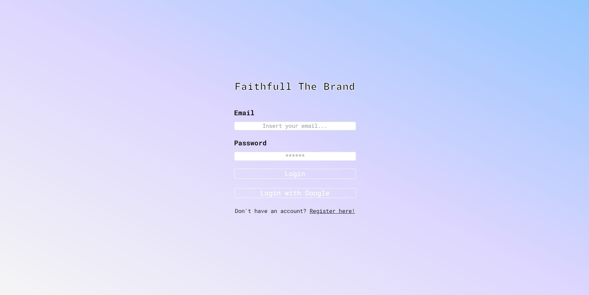
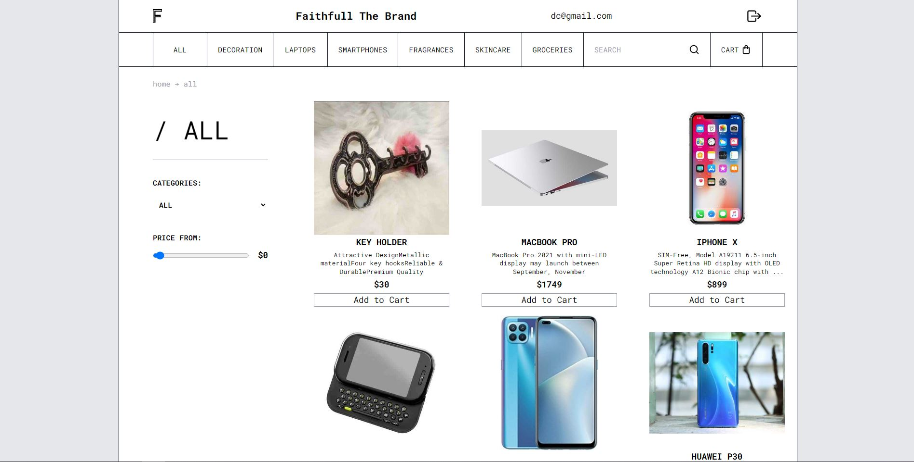
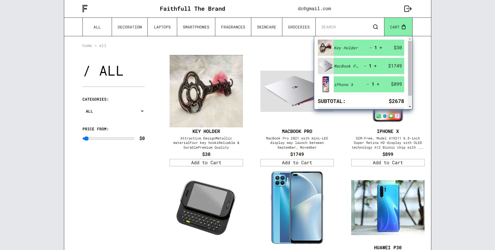

# E-Commerce with React, Firebase Auth y TailwindCss.

Web E-commerce con autenticación vía Firebase (como backend as a service) y TailwindCSS para los estilos.

## Login Page

Login ingresando email & password O login via una cuenta de Google con popup.
En caso de haber un error al realizar el login éste se muestra en la pantalla.

## Register Page

Registro de un nuevo usuario mediante email & password. En caso de haber un error al realizar el register éste se muestra en la pantalla.

## Home Page

En la barra superior se pintan de manera dinámica los datos del usuario que ingreso.

Por defecto se listan todos los productos(PLP: product listing page). Cuenta con filtros por categorias (a través de una barra o a través de un input de tipo select), por precio (a través de un input de tipo rango) y por búsqueda (a través de un input de tipo texto).

Se pueden agregar productos al carro de compras y éste cambia su background color a verde cuando posee al menos un producto. Desde el carro de compras se puede sumar o restar cantidades y se muestran los precios por unidad y el precio total. También se puede limpiar el carro de compras.

Cuenta con localStorage para que el usuario al volver a iniciar sesión aún conserve sus productos en el carro.

Botón de Logout: en la esquina superior izquierda para cerrar la sesión actual y que redirige a la página de Login.

